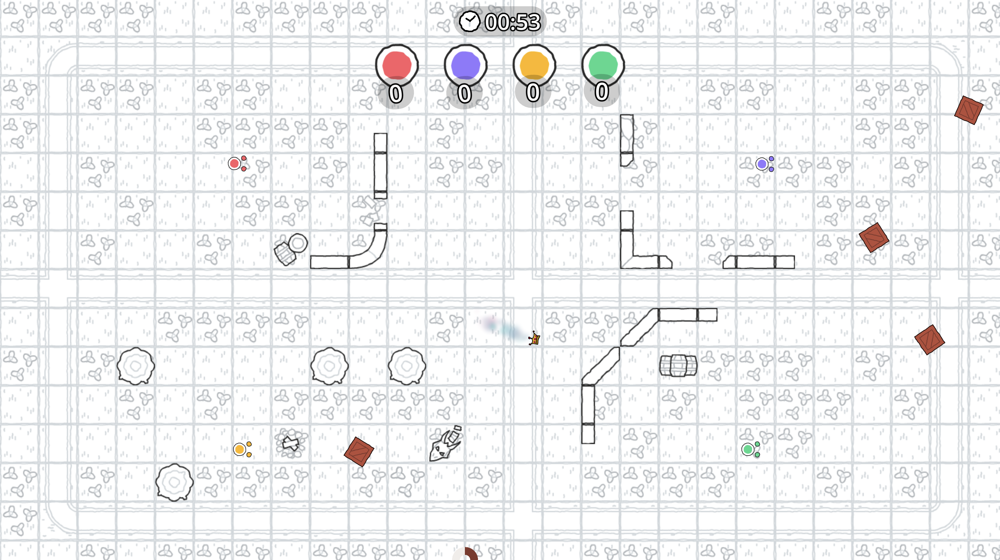

  <a href="https://nanomars.github.io/scribble-brawlr/">
    <picture>
      <source media="(prefers-color-scheme: dark)" srcset="Icon.png">
      
    </picture>
  </a>

  <h1>scribble brawlr</h1>
  
<em>Chaotic paper brawling fun, right in your browser.</em>

  

    
    
  

  
  

---

**Scribble Brawlr** is a frantic, fun, browser-based local multiplayer multiplayer fighting game. Inspired by chaotic couch co-op games and drawn in a quirky paper style, it's a blast to play with friends or enemies.

---

### 🖼️ Screenshots

  
  

---

### 📦 Attribution

This project uses the following packages and assets:  
See full attributions [here](Attribution.md)